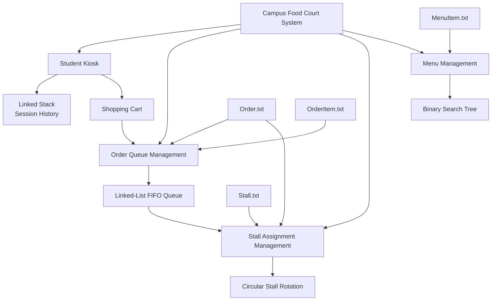
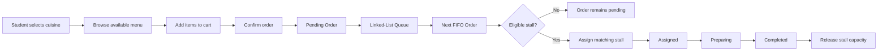
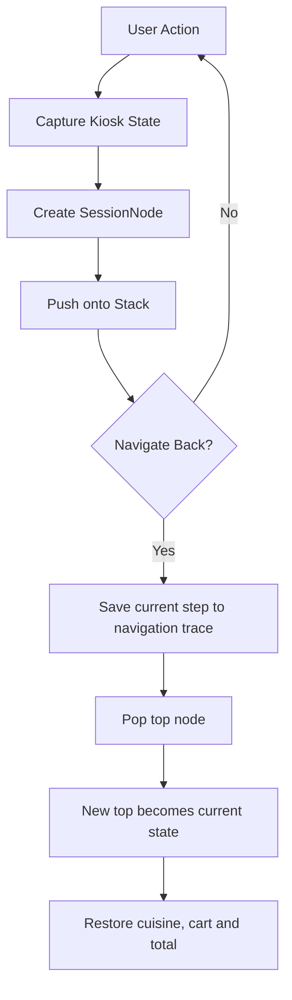

# Campus Food Court Data Structures System

> A C++ console application that applies fundamental data structures to student ordering, order processing, stall rotation, session navigation, and menu management.

## Overview

The **Campus Food Court Data Structures System** is a university Data Structures project developed in C++ to demonstrate how abstract data structures can solve practical application problems.

Rather than implementing queues, stacks, circular structures, and binary search trees as isolated exercises, this project integrates them into a single campus food-court workflow.

The system contains four core modules:

* **Order Queue Management** — processes pending food orders using a manually implemented linked-list FIFO queue.
* **Stall Assignment Management** — rotates orders among cuisine-compatible stalls using circular traversal and capacity checks.
* **Session History & Navigation** — records kiosk states in a linked stack and supports Back navigation by restoring previous states.
* **Menu Item Search & Management** — stores menu items in a Binary Search Tree for recursive searching, traversal, insertion, and deletion.

The application also provides student ordering, shopping-cart operations, cuisine filtering, file-backed data loading, order-status management, formatted console output, and input validation.

---
## My Contribution

This project was developed as a group assignment for a university Data Structures module.

My primary responsibility was the **Order Queue Management module**, where I implemented a manually linked **FIFO queue** for managing pending food orders.

My contribution included:

- Designing the `QueueNode` structure for pending orders
- Implementing the `OrderQueue` class using `front` and `rear` pointers
- Implementing O(1) enqueue and dequeue operations
- Implementing front/peek functionality for the next pending order
- Loading existing pending orders into the queue
- Displaying pending orders and their associated item details
- Supporting completed-order storage and display
- Integrating the queue with the student kiosk and stall-assignment modules

The **Session History & Navigation**, **Stall Assignment**, and **Menu Item Search & Management** modules were primarily implemented by other members of the project team and integrated into the complete application.

---
## Problem Statement

A campus food-court system must coordinate several types of information with different processing requirements.

Pending orders should be processed in arrival order, stall assignments should rotate among suitable food stalls, users should be able to return to previous kiosk states, and menu records should support efficient ordered searching and modification.

Using one data structure for all of these operations would not model their behaviour effectively.

This project therefore applies different data structures according to the requirements of each subsystem:

| Requirement                                 | Data-Structure Choice                     |
| ------------------------------------------- | ----------------------------------------- |
| Process orders in arrival order             | Linked-list FIFO Queue                    |
| Rotate assignments among compatible stalls  | Circular traversal / circular queue logic |
| Restore earlier kiosk states                | Linked Stack                              |
| Search and maintain menu records by Item ID | Binary Search Tree                        |

---

## Key Features

### Student Kiosk

The student-facing ordering workflow supports:

* Student ID input validation
* Cuisine selection
* Cuisine-filtered menu display
* Menu availability checking
* Adding items to a shopping cart
* Quantity updates
* Item removal
* Cart-total calculation
* Changing cuisine when the cart is empty
* Order confirmation and cancellation
* Automatic order-ID generation
* Session-state recording
* Back navigation

### Order Queue Management

Pending orders are maintained using a manually implemented linked-list queue.

Supported operations include:

* Enqueue a new pending order
* Access the next order without removing it
* Dequeue the next order
* Display all pending orders
* View individual order details and items
* Maintain orders completed during the current execution

### Stall Assignment Management

Orders are assigned only to stalls serving the required cuisine.

The module supports:

* Cuisine-specific rotation pointers
* Circular traversal using modulo arithmetic
* Skipping closed stalls
* Skipping stalls that have reached capacity
* Rotating to the next compatible stall after assignment
* Viewing current cuisine rotations
* Opening and closing stalls
* Preventing a stall with active orders from being closed
* Order-status progression:

```text
Pending → Assigned → Preparing → Completed
```

When an order is completed, the assigned stall's active-order count is reduced and capacity is released.

### Session History & Navigation

Each significant student action can record a complete kiosk state containing:

* Current screen
* Selected cuisine
* Shopping-cart contents
* Cart quantities
* Item prices
* Cart total

The linked stack allows the application to:

* Push newly recorded states
* Pop the current state during Back navigation
* Restore the previous kiosk state
* Display complete session history
* Display the current active stack
* Display the Back-navigation trace

### Menu Search & Management

Menu items are inserted into a manually implemented Binary Search Tree using `itemID` as the key.

The module supports:

* Recursive BST insertion
* Recursive BST search
* In-order traversal
* Menu-item creation
* Updating menu-item attributes
* BST deletion
* Persistence of menu changes to `MenuItem.txt`

BST deletion handles all three standard cases:

1. Leaf node
2. Node with one child
3. Node with two children

For a two-child deletion, the implementation replaces the target with the minimum node from its right subtree before recursively deleting that successor.

---

# Data Structures & Algorithms

The principal objective of this project is to demonstrate appropriate selection and manual implementation of data structures.

| Module             | Data Structure                      | Implementation                                                             | Purpose                                         | Important Operations                          | Complexity                                                        |
| ------------------ | ----------------------------------- | -------------------------------------------------------------------------- | ----------------------------------------------- | --------------------------------------------- | ----------------------------------------------------------------- |
| Order Queue        | Linked-list FIFO Queue              | Dynamically allocated `QueueNode` objects with `front` and `rear` pointers | Preserve first-in, first-out order processing   | Enqueue, dequeue, front/peek                  | Enqueue **O(1)**, Dequeue **O(1)**, Peek **O(1)**                 |
| Completed Orders   | Singly Linked List                  | Dynamically allocated `CompletedNode` objects                              | Retain orders completed during execution        | Append, traversal                             | Append **O(n)**, Display **O(n)**                                 |
| Session Navigation | Linked Stack                        | `SessionNode` objects connected through `next`, accessed through `top`     | Restore previously recorded kiosk states        | Push, pop/back                                | Stack link operations **O(1)**                                    |
| Stall Assignment   | Circular traversal over fixed array | Cuisine-specific indices plus modulo-based wrap-around                     | Rotate assignments among compatible stalls      | Find eligible stall, advance rotation pointer | Traversal-dependent; worst case may scan multiple stall positions |
| Menu Management    | Binary Search Tree                  | Dynamically allocated `MenuNode` objects with `left` and `right` pointers  | Search and maintain menu items by Item ID       | Insert, search, delete, traversal             | Search/Insert/Delete **O(h)**; worst case **O(n)** if unbalanced  |
| Menu Display       | BST in-order traversal              | Recursive left → root → right traversal                                    | Display menu records in ascending Item ID order | In-order traversal                            | **O(n)**                                                          |

Here, `n` represents the relevant number of stored records and `h` represents the height of the BST.

---

## Why These Data Structures?

### Linked-List Queue — Order Processing

A food-order queue naturally follows **First In, First Out (FIFO)** behaviour.

The order at the front should be handled before orders submitted later.

Using both `front` and `rear` pointers allows a new order to be appended without traversing the linked list, giving constant-time enqueue and dequeue operations.

```text
Front                                      Rear
  ↓                                          ↓
ORD1002 → ORD1003 → ORD1004 → ORD1005 → ORD1006
```

When an order is processed, only the front node is removed.

---

### Linked Stack — Session History

Back navigation follows **Last In, First Out (LIFO)** behaviour.

The latest user state should be removed first when the user requests Back navigation.

```text
TOP
 ↓
[Added Item]
     ↓
[Browsed Menu]
     ↓
[Login]
```

Each stack node stores both the action information and a snapshot of the kiosk state.

After the top node is popped, the next node becomes the current state and its saved cart and navigation information can be restored.

---

### Circular Rotation — Stall Assignment

A linear assignment sequence would eventually reach the final stall and require manual resetting.

The stall-assignment module instead wraps traversal back to the start using modulo arithmetic:

```cpp
(current + 1) % countSTALL
```

Cuisine types maintain their own current rotation positions.

For example:

```text
Malay:
STL01 → STL02 → STL03 ─┐
  ↑                     │
  └─────────────────────┘
```

When assigning an order, the system checks compatible stalls until it finds one that:

* serves the requested cuisine,
* is not closed, and
* has remaining capacity.

After a successful assignment, the rotation advances to the next compatible stall.

---

### Binary Search Tree — Menu Management

Menu records are ordered using their Item IDs.

For each comparison:

* a smaller Item ID moves into the left subtree;
* a larger Item ID moves into the right subtree.

Example conceptual structure:

```text
             MI013
            /     \
        MI007      MI019
        /   \       /   \
     MI004 MI010 MI016 MI022
```

This makes the BST suitable for demonstrating ordered searching, recursive insertion, recursive traversal, and the standard BST deletion cases.

Because the tree is not self-balancing, operations are **O(h)** rather than guaranteed **O(log n)**. In the worst case, a highly skewed tree can approach **O(n)** behaviour.

---

# System Architecture



---

# Order Processing Workflow



---

# Session Navigation Workflow



---

# File Structure

For the current implementation, the safest repository layout is:

```text
campus-food-court-dsa-system/
│
├── main.cpp
│
├── MenuItem.txt
├── Order.txt
├── OrderItem.txt
├── Stall.txt
│
├── Student.txt
├── Sessions.txt
├── SessionAction.txt
│
├── docs/
│   └── screenshots/
│
├── README.md
└── .gitignore
```

> **Important:** `main.cpp` currently opens `MenuItem.txt`, `Order.txt`, `OrderItem.txt`, and `Stall.txt` using relative filenames. These four files should therefore remain in the program's working directory unless the corresponding paths in the source code are changed.

`Student.txt`, `Sessions.txt`, and `SessionAction.txt` may be retained as supporting/sample datasets, but the current `main.cpp` does not load them.

---

# Data Files

## `MenuItem.txt`

Stores menu information using pipe-separated fields:

```text
itemID|itemName|itemCategory|cuisineType|price|availability|prepTime
```

Example:

```text
MI001|Nasi Lemak|Main Meal|Malay|6.5|Available|10
```

---

## `Order.txt`

Stores order-level information:

```text
orderID|studentID|cuisineType|orderStatus|assignedStallID|total|orderTime
```

Example:

```text
ORD1002|TP077333|Malay|Pending|NONE|12|2026-07-20 12:04:00
```

---

## `OrderItem.txt`

Stores item-level information associated with orders:

```text
orderItemID|orderID|itemID|quantity|unitPrice|lineTotal|custNotes
```

---

## `Stall.txt`

Stores stall information:

```text
stallID|stallName|cuisineType|stallStatus|maxCapacity|currentOrderCount|rotationPos
```

---

## Supporting Dataset Files

The repository also contains:

```text
Student.txt
Sessions.txt
SessionAction.txt
```

These represent student, kiosk-session, and recorded-action data respectively. They are useful for demonstrating the broader dataset design, although they are not currently consumed by `main.cpp`.

---

# Requirements

The application uses standard C++ libraries only.

Recommended environment:

* C++17-compatible compiler
* GCC / MinGW-w64, Clang, or Microsoft Visual C++
* Terminal or command prompt
* The required `.txt` data files in the executable's working directory

The program has no external library dependencies.

---

# Build and Run

## GCC / MinGW

Compile:

```bash
g++ -std=c++17 -Wall -Wextra -pedantic main.cpp -o foodcourt
```

Run on Windows:

```bash
foodcourt.exe
```

Run on Linux/macOS:

```bash
./foodcourt
```

---

## Visual Studio

1. Create or open a C++ Console Application.
2. Add `main.cpp` to the project.
3. Place the required text files in the program's working directory.
4. Build the project.
5. Run the application.

If the text files cannot be found, verify the working-directory configuration used by the IDE.

---

# Main Menu

When launched, the system provides four functional areas:

```text
===== Campus Food Court Kiosk System =====
1. Student Kiosk
2. Order Queue Management
3. Stall Assignment Management
4. Menu Management
5. Exit
```

---

# Example Workflow

A typical end-to-end workflow is:

```text
1. Student enters a TP-format Student ID
             ↓
2. Student selects a cuisine
             ↓
3. Matching menu items are displayed
             ↓
4. Student adds items to the cart
             ↓
5. Session states are recorded on the stack
             ↓
6. Student confirms checkout
             ↓
7. Order enters the pending FIFO queue
             ↓
8. Administrator requests the next order
             ↓
9. Stall rotation searches for an eligible stall
             ↓
10. Order becomes Assigned
             ↓
11. Status changes to Preparing
             ↓
12. Status changes to Completed
             ↓
13. Stall capacity is released
```

---

# Technical Highlights

### Manual Data-Structure Implementations

The project deliberately implements the core structures manually rather than replacing them with STL containers such as `std::queue`, `std::stack`, or `std::map`.

This makes the pointer manipulation and algorithmic behaviour visible for academic assessment.

### Dynamic Memory

The linked queue, linked stack, completed-order list, and BST allocate nodes dynamically using `new`.

Individual nodes are deleted when:

* a pending order is dequeued,
* a session state is popped,
* session history is cleared, or
* a BST menu node is deleted.

### State Restoration

The session-history subsystem stores complete kiosk snapshots rather than only action labels.

A previous state can therefore restore:

* selected cuisine,
* cart size,
* item IDs,
* item names,
* quantities,
* unit prices,
* line totals, and
* overall cart total.

### Persistent Menu and Stall Updates

Menu modifications are written back to `MenuItem.txt`.

Stall and order status updates use temporary-file replacement logic when updating their corresponding text files.

### Defensive Input Handling

Several menus detect invalid numeric input using:

```cpp
cin.clear();
cin.ignore(...);
```

The application also validates item IDs, positive prices, positive preparation times, menu availability, cart capacity, stall capacity, and permitted order-status transitions.

---

# Current Constraints

This is an academic console application and has several deliberate or current limitations:

* Data is stored in pipe-delimited text files rather than a database.
* Core collections use fixed maximum capacities in several areas.
* The BST is not self-balancing.
* Stall rotation uses a fixed stall array with circular traversal rather than dynamically allocated circular nodes.
* The application is single-process and single-user.
* There is no graphical user interface.
* There is no networking or web functionality.
* Student IDs are format-checked but the current kiosk code does not authenticate them against `Student.txt`.
* `Student.txt`, `Sessions.txt`, and `SessionAction.txt` are not currently loaded by the executable.
* Runtime data structures and persisted text files are not yet fully synchronized for every operation.

---

# Possible Future Improvements

Potential extensions, while preserving the educational purpose of the project, include:

* Persist newly submitted orders and their line items immediately to `Order.txt` and `OrderItem.txt`.
* Validate Student IDs against `Student.txt`.
* Persist session and navigation actions using `Sessions.txt` and `SessionAction.txt`.
* Add explicit cleanup functions/destructors for every dynamically allocated structure.
* Replace duplicated numeric limits with shared named constants.
* Strengthen bounds checking when loading text files.
* Separate the large source file into headers and implementation files by module.
* Centralize repeated pipe-delimited file parsing.
* Improve transactional safety when replacing text files.
* Add a resettable demonstration dataset for reproducible testing.
* Add automated tests for queue, stack, BST, and stall-rotation edge cases.

---

# Contributors

This project was completed as a group university assignment.

| Contributor                      | Student ID | Responsibility                |
| -------------------------------- | ---------- | ----------------------------- |
| Balqis Syazwina Binti Hisyam     | TP077278   | Order Queue Management        |
| Siti Nur Zafirah Binti Zunaidi   | TP077333   | Session History & Navigation  |
| Nurun Najihah Binti A. Azmi      | TP077342   | Stall Assignment Management   |
| Nur Aina Dalili Binti Mohd Rafix | TP077312   | Menu Item Search & Management |

> Update this section if your university requires a different attribution format.

---

# Academic Context

This repository contains work produced for a university **Data Structures** assignment.

The implementation intentionally demonstrates manual data-structure construction and pointer manipulation for educational purposes. Some design decisions therefore prioritize visibility of data-structure concepts over the abstractions that would typically be preferred in production C++ software.

The repository should not be interpreted as a production-ready food-ordering platform.

---

# Acknowledgements

Developed as part of university coursework in Data Structures using C++.

The project demonstrates the practical application of:

* FIFO queues
* linked lists
* stacks
* circular traversal
* Binary Search Trees
* recursion
* dynamic memory
* file handling
* algorithmic complexity analysis

---

## Project Status

**Academic project — functional prototype**

The principal focus of the project is demonstrating how different data structures can cooperate within one integrated application.
